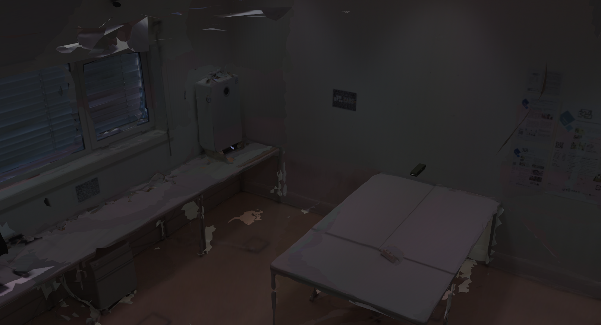
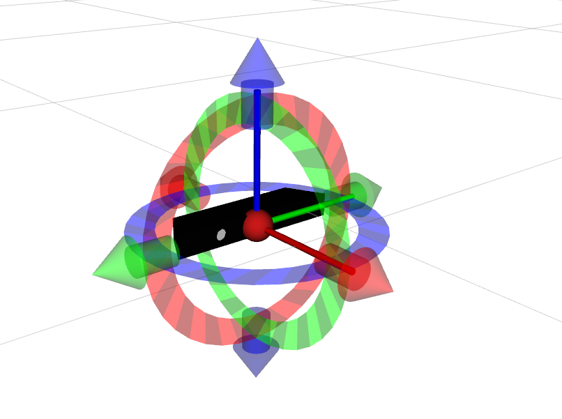

# localization_end_to_end

**Local**ization **Bot** (localbot) is a conceptual robot designed to test end-to-end localization algorithms. The system contains the following sensor:

- **hand_camera** - A RGB-D camera






### Add to .bashrc:

```
export GAZEBO_MODEL_PATH="`rospack find localbot_gazebo`/models:${GAZEBO_MODEL_PATH}"
```

# Running the simulation

To launch the gazebo with the room_024.world run:

    roslaunch localbot_gazebo localbot.launch

To spawn the robotic system into the gazebo run:

    roslaunch localbot_bringup bringup.launch

# Collecting the data

In each frame we store:

- **frame-X.pcd** - The point cloud w.r.t. the rgb_frame
- **frame-X.pose.txt** - The 4x4 transformation matrix from world to rgb_frame
- **frame-X.rgb.png** - The rgb image

For collecting each frame, we have four options:

1.  **interactive**

        rosrun localbot_core data_collector --mode interactive --seq seq110

Here we have to manually drag the interactive marker and click on another marker to save each frame of the dataset.

2.  **automatic_random**

        rosrun localbot_core data_collector --mode automatic_random --seq seq110 -nf 1000

In this case, in each frame, it is generated a random pose. Here we do not have any movement between poses.

video:

https://uapt33090-my.sharepoint.com/:v:/g/personal/danielsilveiracoelho_ua_pt/ERR9giFm8ZREiKSNzqZQNaABZ38q4M1HU_Zte4d_4e1Zxg?e=oGkjRv

3.  **automatic_path** with random poses 

        rosrun localbot_core data_collector --mode automatic_path --seq seq110 -ns 20  -nf 1000

In this case, it is generated a random pose, and then the camera moves towards that pose in a continuous movement. As soon as the pose is reached, another pose is generated, and so on... One hyperparameter that must be defined is the number of steps (n_steps). Basically, it is the number of iterations between the initial pose and the final pose. 

video: 

https://uapt33090-my.sharepoint.com/:v:/g/personal/danielsilveiracoelho_ua_pt/Ef34nF86NIVEsGxx6OH2jE8BbOZAVPP9-_WT9ltrG2xr0g?e=xPEihX


4.  **automatic_path** with the desired pose 

        rosrun localbot_core data_collector --mode automatic_path --seq seq110 --ns 20 --destination_pose '1,4,0,0.5,0.2,1.5'

In this case, we have to define where we want the model to go, and then a path is generated towards that pose. 


# Processing the dataset

Run:

    rosrun localbot_localization process_dataset -d 'seq44' -s '_processed' -fi 0.5 -pts 1000 -igp


# Validating the datasets

Every collected dataset MUST be validated.

Run:

    rosrun localbot_localization validate_dataset -d 'seq_depth_test_depth_stat_local_norm'

# Merging different datasets

It is possible to merge different datasets. All datasets should be considered valid before merging...

Run:

    rosrun localbot_localization merge_dataset -dataset1 'seq1_v' -dataset2 'seq1_v' -merged_dataset 'merged_dataset'


# Visualizing the training set

Run:

    roslaunch localbot_localization visualize_train_set.launch train_set:=seq110


# Training the models

**PointNet**

    rosrun localbot_localization point_net_training -fn test1 -mn pointnetv0 -train_set seq110 -test_set seq111 -n_epochs 5 -batch_size 2 -loss 'DynamicLoss()'

**DepthNet**

    rosrun localbot_localization depth_training -c -fn model_depth -mn depthv0 -train_set 'seq_test0_d_v' -test_set 'seq_test0_d_v'


# Producing the results

**PointNet**

    rosrun localbot_localization point_net_produce_results -test_set seq111 -mp test1 -rf results_folder

**DepthNet**

    rosrun localbot_localization depth_net_produce_results -test_set 'seq1d_p_global_norm' -mp 'depth_low_global_norm' -rf results15

**PoseNet**

    rosrun localbot_localization posenet_training -fn posenett_test_dataset_new -mn depthv0 -train_set 'seq6_d' -test_set 'seq6_d' -n_epochs 10  -batch_size 2 -im 'PoseNetGoogleNet(False)' -ss 2 -c

# Visualizing the results

Run:

    roslaunch localbot_localization visualize_results.launch results_folder:=results19 frame_selection_function:="'pos[idx]>1.5 and rot[idx]>0.2'"
    roslaunch localbot_localization visualize_results.launch results_folder:=results19 idx_max:=10


# Extras:
## Using SfM to collect data

    rosrun localbot_localization create_images_sfm -d 'seq5_sfm' -s '_images'

    cd ~/PhD/localization/Meshroom-2021...

    ./Meshroom

## Using Visual Odometry to collect data

    git clone https://github.com/FlagArihant2000/visual-odometry
    cd /visual-odometry/code/
    python3 main.py

    run our scripts...